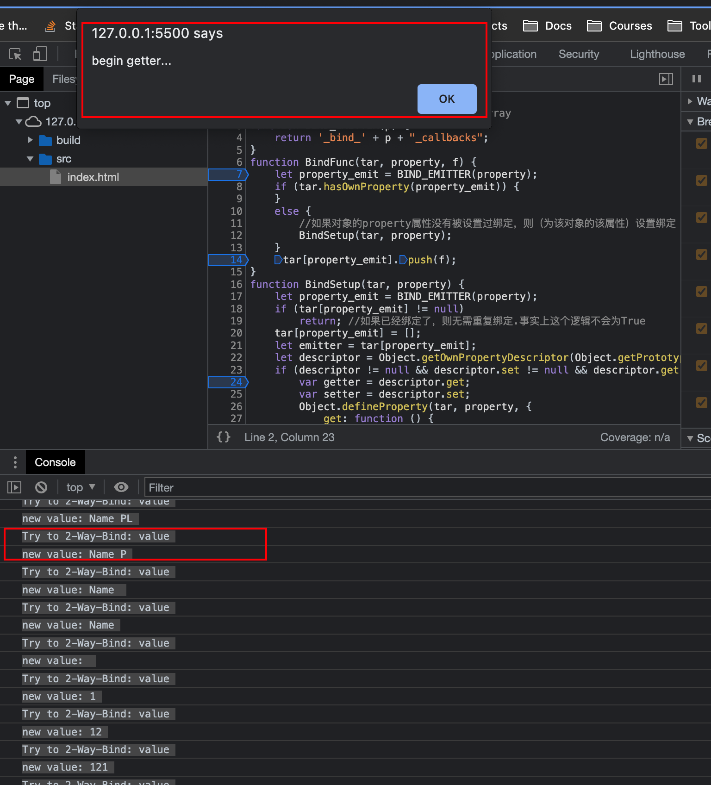
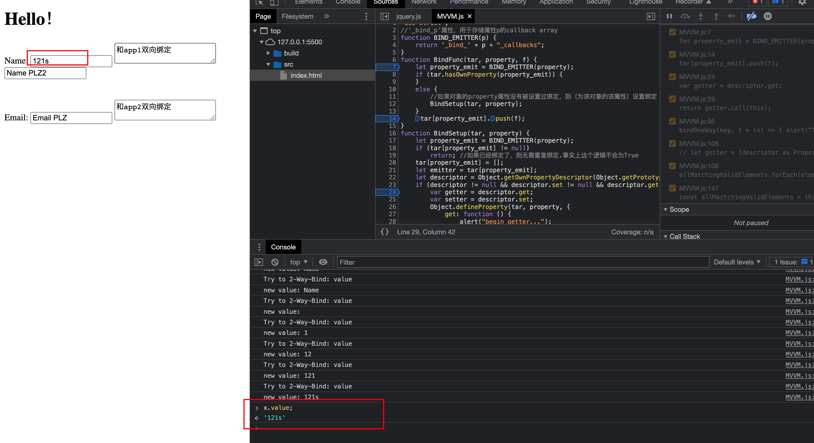
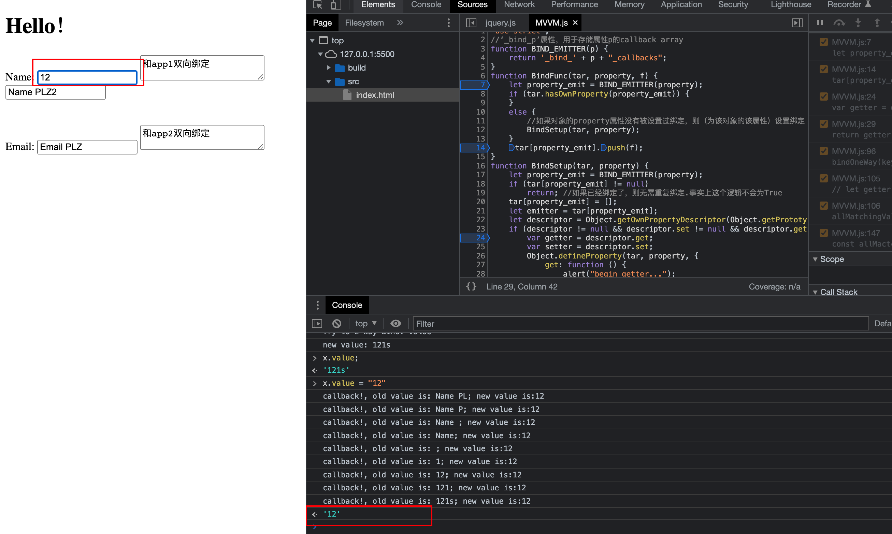
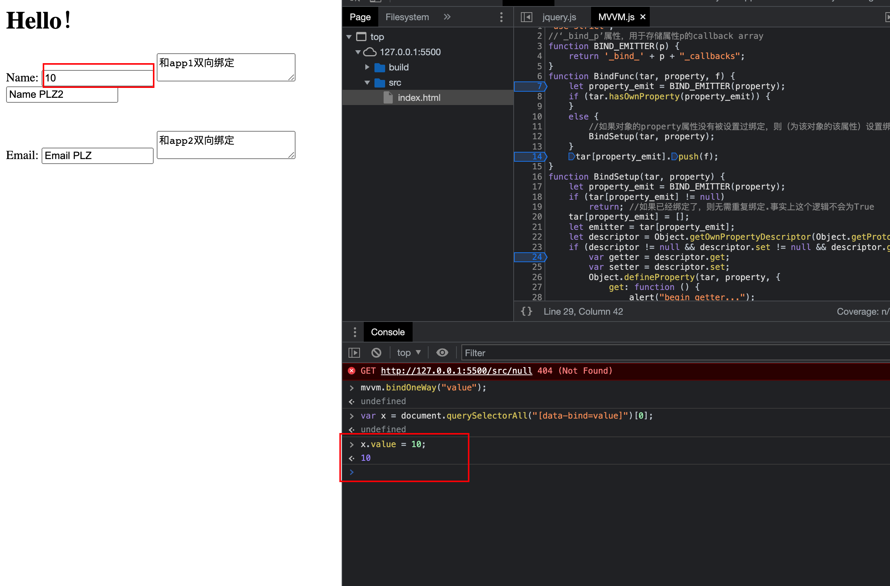

# Get Start

1. 进入源文件目录

   ```
   cd src
   ```

2. 编译项目(Ts -> Js)

   ```
   tsc -p ../tsconfig.json
   ```

3. (可能需要):

   ```
   npm run build
   ```

4. 浏览器中查看:

   1. 注释掉`MMVM.ts`文件最后的：

      ```
      export{
        MVVM, simpleBindFunc, simpleBindTwoWay
      }
      ```

      然后重新编译项目。（ 因为浏览器不支持`export`语法，在浏览器运行js时需要把这段注释掉）

   2. 选择`index.html`，使用OpenWithLiveServer打开

5. 运行测试:

   取消上述注释，重新编译项目，然后:

   ```
   npm run test
   ```

   

# 功能展示

双向绑定就是单向绑定+事件监听。 我只监听了`input`事件，因此对于`<input />`等HTML元素，在双向绑定下，每次输入都会触发一次事件，并导致一次单向绑定。 单向绑定就是把对应元素的对应的属性添加一些回调函数，这些回调函数会在该属性的setter调用时被调用。 具体逻辑很复杂，建议看代码。文档里只是演示一下。


## 双向绑定

1. 对key="value"进行双向绑定:

   ```
   mvvm.bindTwoWay('value');
   ```

   所有`[data-bind=value]`的Dom元素已经双向绑定了

   

2. 选择任意一个具有`[data-bind=value]`的（即被双向绑定的）Dom元素。 这里选择第一个:

   ```
   var x = document.querySelectorAll("[data-bind=value]")[0];
   ```

   上面我选的元素是一个`<input />`HTML元素，我对于所有的元素，监听其input事件，每当事件发生，就加入一次回调函数。 回调函数在元素的setter函数被调用时触发。 这个逻辑比较复杂，需要看代码。 我在文档中只演示一下效果

3. 在浏览器页面中，在对应的`<input />`输入框内输入若干内容， 会发生以下事件（证明触发了双向绑定）：

   1. 每进行一次输入，就会`alert`一段文字
   2. console会打印两行文字

   

   * 由于元素监听了input事件，每输入一个字符就会触发一次input事件， 并导致该元素的该属性(这里绑定了`value`属性)多进行一次单向绑定，后者会向绑定的元素的对应属性(这里是`value`)绑定一个回调函数，回调函数在该属性的setter调用时触发.

4. 然后用JS来查看元素的value值， 发现用户输入的内容（ **view 层**）改变了元素的属性值（**model层**）: value值现在等于用户输入值. 

   

5. 更改value属性的值，触发元素的setter， 并触发其对应的所有callback。 浏览器页面上的值也同步更改了，这是**model层到view层**的变化

   

   这里我之前输入了9个字符，触发了9次input，因此setter调用时触发了9个回调函数


由此，证明了view -> model -〉 view层的变化，即双向绑定

## 单向绑定

1. 依然以`value`为例，进行单向绑定：

   ```
   mvvm.bindOneWay("value");
   ```

2. 选择第一个绑定的元素：

   ```
   var x = document.querySelectorAll("[data-bind=value]")[0];
   ```

3. 修改元素的value值，看到浏览器页面上的显示内容也同步改变:

   

* 在这之前还会弹出两个alert，这是单向绑定给该元素的`value`属性添加的回调


这里表现了 model层 -> view层的改变，证明了单向绑定

# MVVM框架

MMVM代码位于`src/MVVM.ts`

## 功能

实现了：

* **单向绑定**：其实现逻辑包括**数据劫持**和**发布订阅** 

* **双向绑定**：相当于事件监听+单向绑定（ 因此逻辑最重要的地方是单向绑定）

* Jest测试：

  注意，由于MVVM框架测试需要浏览器环境，而能够模拟浏览器环境的工具我只找到了jsdom， 它只支持commonJS，我不知道如何用ES6来引入jsdom。 因此没能在Jest中用浏览器环境测试，这导致了MVVM的api无法测试。 为此，我把单向和双向绑定逻辑抽象了出来，写了两个替代的函数，来进行Jest测试


## 双向绑定

```typescript

  //
  /**
   * 选择出所有要进行双向绑定的Dom元素，将其对应的属性(key)和回调函数绑定到事件监听
   * 回调函数：这里选择最简单的做法，将“输出Dom元素的value的值”这个函数作为回调函数进行绑定
   * 注意： 每次事件发生，就会绑定一次。例如，如果input了三次，就会调用三次bindOneWay，绑定3个callback
   * 
   * 比如,我绑定事件为input，key为deposit，则双向绑定会选择出所有拥有key为deposit的Dom节点，对这些节点添加input事件的监听， 并且修改这些节点的key属性的
   * getter和setter，使得事件触发时，节点能对其key属性做出对应的行为
   * @param listenEvents   对于双向绑定，要监听的Dom事件集合。 这里只有input
   * @param key 
   */
  bindTwoWay( key:string, listenEvents:Array<string> = ['input'] ):void{
    //checlKeyInScope?

    //得到所有合法的DOm节点，进一步筛选出其中要双向绑定的节点
    const allMactchingValidElements = this.getAllMactchingValidElements(key);


    allMactchingValidElements.forEach(element => {
      // listenEvents = ['input', 'click'];
      listenEvents.map(event => {
        //双向绑定： 事件监听+单向绑定
        //对每个element，为listenEvents中的每个事件添加事件监听。 
        //监听过程就是将用户输入的view值(view layer)输入到model，进行单向绑定
        element.addEventListener(event, (e) => {
          
            console.log("Try to 2-Way-Bind: " + key);

            let newVal = (element as HTMLInputElement).value;
            console.log("new value: " + newVal );

            //这里的实现是： 每监听到一次事件，就绑定一次（绑定一个回调函数）。 因此如果input了三次，就会绑定3个callback
            this.bindOneWayWithValue(key,newVal);
          // if (this.checkKeyInScope(key)) {
          //   console.log("Try to 2Bind: " + key);
          //   this.bindOneWayWithValue(key,(element as HTMLInputElement).value)
          // }
        })
      })
    })

}
```


## 单向绑定

“绑定”的意思是将回调函数绑定到某个对象。

如果要绑定属性`key`，则找到所有满足条件(含有`data-bind=key`属性)的Dom元素(即`allMatchingValidElements`)， 然后用`BindFunc()`依次绑定每个对象和回调函数。

* 如果是由双向绑定调用的单向绑定，前者会构造好一个函数作为`bindOnwWay`的参数`f`传入， 如果是用户直接调用的单向绑定，就需要由用户来提供回调函数`f`了。

* 不过，用户也可以不提供回调函数，此时`f`会有一个默认的值


```typescript

  /**
   * 单向绑定
   * 该函数是幂等的
   * 
   * @param key 
   * @param f 该函数一般通过bindOneWayWithValue()调用，此时前者会传回调函数f作为参数。 用户也可以单独调用该函数，
   * 此时如果不传f，则f赋值为默认的回调函数
   * @returns 
   */
  bindOneWay(key: string, f: (v:any) => void = (v:any) => { alert("This is default setter callback!")} ) {
    if( !this.isValidKeyToBind(key)  ) return; //如果该Key不合法，直接返回
    // if( this.checkKeyInScope(key) ) return; //如果该key已经被绑定过，则无需再次绑定

    const allMatchingValidElements = this.getAllMactchingValidElements(key);//得到所有匹配key的合法的Dom元素
    if( allMatchingValidElements.length === 0 ) return;

    //tmp
    // let descriptor = Object.getOwnPropertyDescriptor(Object.getPrototypeOf(this.scope), key);
    // let getter = (descriptor as PropertyDescriptor).get;

    allMatchingValidElements.forEach( element=>{
      BindFunc(element,key,f );
    })
    
    // Object.defineProperty(this.scope, key, {
    //   set: function (newValue) {
    //     allMatchingValidElements.forEach((element) => {
    //       if (checkBindElement(element)) {
    //         (element as HTMLInputElement).value = newValue
    //       } else {
    //         element.innerHTML = newValue
    //       }
    //     })
    //   },
    //   get: function () {
    //     return (getter as ()=> any).call(this);
    //   },
    //   enumerable: true
    // })
      
  }

  bindOneWayWithValue(key: string, value:string | number) {
      //这里的value是双向绑定时传入的（也就是input触发时），在当时是newValue，
      //但是当回调函数调用时，该值已经算是old value了。 setter的参数v才是new value
      this.bindOneWay(key, (v:any)=> {console.log("callback!, old value is: " + value + "; new value is:" + v )} )
      // this.scope[key] = value;

      // alert("new value shoube be: " + value );

      // alert("new value actually is: " + this.scope[key as keyof typeof this.scope] );
  
  }
```


# 测试

测试代码位于`src/MMVM.test.ts`, 由于之前所述的原因，只对单/双向绑定的抽象api进行了测试

## 双向绑定

```typescript
/**
     * 测试双向绑定，过程为：一开始obj1和obj2的name不同， 我将obj1和obj2的name属性双向绑定后,\\
    对obj1.name进行修改(即调用setter)会触发回调函数， 而回调函数的逻辑是会更改obj2的name属性。 对obj2.name的修改又回触发obj2的name的回调函数，\\
    其逻辑是会修改obj1的name属性。 由于obj1的name的值已经变过了，按照我的逻辑，第二次回调不会发生作用，整个过程因此结束。 最终，obj1和obj2的值必定相等

    例如：将obj1.name设为“宽宽”，则：
    1. 对obj1的name的setter的调用会导致obj1的name的回调触发，将obj2点name也设为宽宽
    2. 对obj2的name的setter的调用又会导致obj1的name的回调触发
    3. 由于obj1的name已经是宽宽了，对obj1对name的回调，按照我的逻辑，由于新旧值没有改变，就不会继续执行下去，整个过程结束
    4. 最终，obj1和obj2的name都是相同值
     */
    const BindTwoWayTestDescription = ""
    test('测试双向绑定', () => {

        simpleBindTwoWay( "name", exampleObj, exampleObjAlter );
        exampleObj.name = "宽宽";
        console.log( "回调成功， obj1的name为："+ exampleObj.name + " ,obj2的name为: " + exampleObjAlter.name );

      expect( exampleObj.name === exampleObjAlter.name  ).toBe(true);
    });
  
```


# 单向绑定核心逻辑

双向绑定的核心逻辑在于单向绑定，后者的核心逻辑在于函数`BunFuc(tar, property, f)`， 它将回调函数`f`单向绑定到对象`tar`的`property`属性上。

* 具体过程是：对于

1. 对于属性`p`, 需要存储它的callback array， 我们新添加一个 `_bind_p_callback`, 作为`p`的callback array
   * 例如，对于属性`value`，新添加一个`_binf_value_callback`,用于存储`p`的所有回调函数。
   * 回调函数在`p`被改变时（即`p`的setter被调用）调用
2. 修改对象的`property`属性的getter和setter
   1. 如果该属性本来就有getter和setter。 则：
      1. 对于新getter，调用原有的getter
      2. 对于新setter， 先调用原有的setter，然后调用所有的被绑定的回调函数
         * 注意到，如果新的value等于旧的value，则没有必要执行执行原来的setter和调用回调函数
   2. 如果该属性本来没用getter或setter，则新建`property_bind`属性，对该属性构造getter和setter，其行为和前面所说的getter和setter类似

```javascript
interface ElementType extends HTMLElement{
  [property:string]: any
}


//‘_bind_p_callback’属性，用于存储属性p的callback array
function BIND_EMITTER(p:string):string{
    return '_bind_' + p + "_callbacks";
}


function BindFunc(tar:ElementType,property:string,f:(v:any)=>void){

  let property_emit:string = BIND_EMITTER(property);
  if(tar.hasOwnProperty(property_emit)){
  }
  else{
    //如果对象的property属性没有被设置过绑定，则（为该对象的该属性）设置绑定
    BindSetup(tar,property);
  }

  (tar[property_emit] as Array<Function>).push(f);

}

function BindSetup(tar:ElementType, property: string) {
  
    let property_emit:string = BIND_EMITTER(property);
    if(tar[property_emit] != null) return; //如果已经绑定了，则无需重复绑定.事实上这个逻辑不会为True
    tar[property_emit] = [];

    let emitter: Array<Function> = (tar[property_emit] as Array<Function>);
    let descriptor = Object.getOwnPropertyDescriptor(Object.getPrototypeOf(tar), property);
    if (descriptor != null && descriptor.set != null && descriptor.get != null) {
        var getter = descriptor.get;
        var setter = descriptor.set;
        Object.defineProperty(tar, property, {
            get: function () {
              alert("begin getter..." );

                return getter.call(this);
            },
            set: function (v: any) {
                let curv = getter.call(this);
                if(curv != v){
                    alert("begin setter..., new value is: " + v );

                    setter.call(this, v);
                    emitter.forEach(f => f(v));
                }
            }
        })
    }
    else {
        let val = tar[property];
        let property_bind = '_bind_' + property+'_p';
        tar[property_bind] = val;//新增一个property_bind属性，其值初始化为property属性的值

        Object.defineProperty(tar, property, {
            get: function () {
                return this[property_bind];
            },
            set: function (v: any) {
                let curv = this[property_bind];
                if(curv != v){
                    this[property_bind] = v;
                    emitter.forEach(f => f(v));
                }
            }
        })
    }
}
```

